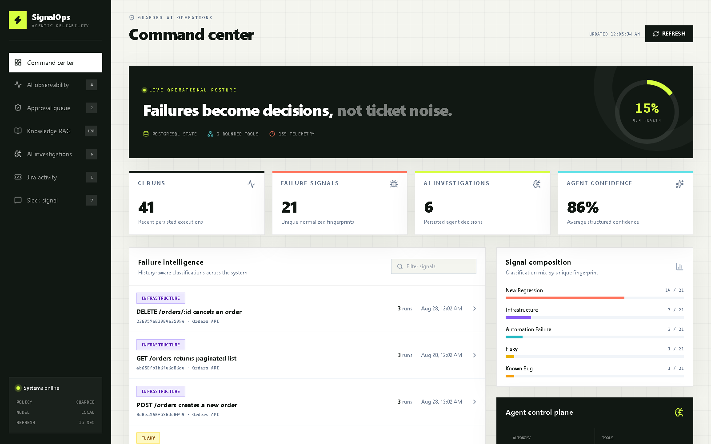
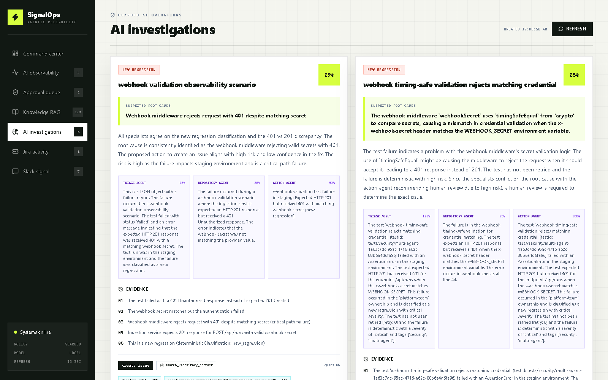
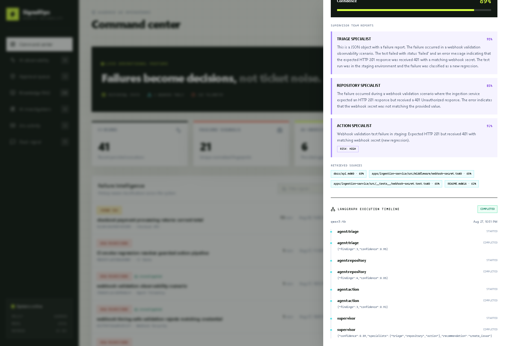
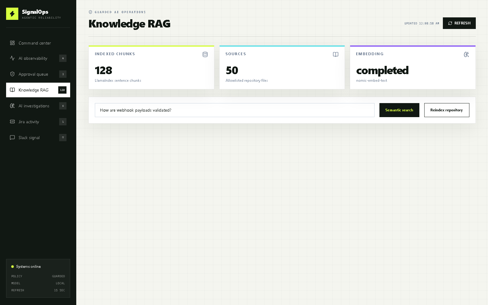
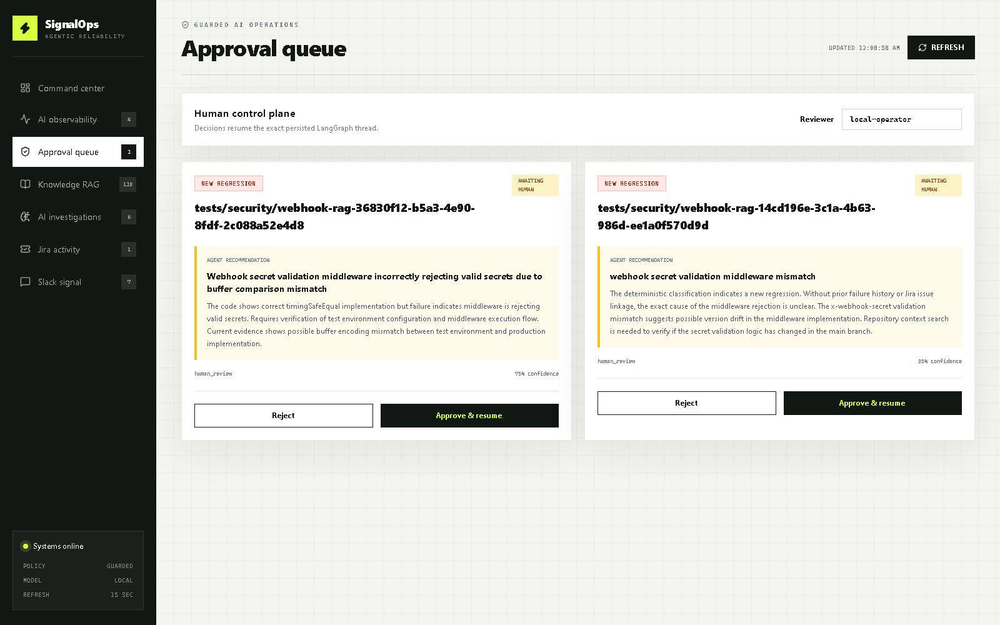
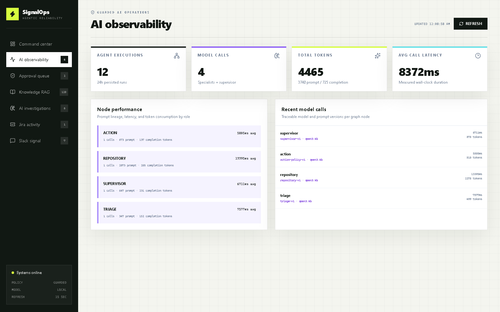

# Agentic Test Failure Orchestrator

> A guarded, local-first Agentic AI platform that turns noisy CI test failures into evidence-backed engineering actions.

[](https://www.typescriptlang.org/)
[](https://nodejs.org/)
[](https://ollama.com/)
[](https://n8n.io/)
[](https://www.postgresql.org/)
[](https://www.docker.com/)



## Skills demonstrated, at a glance

For reviewers scanning quickly: this repository is a working implementation of the core competencies behind an **AI automation / agentic AI engineering** role, not a single notebook or prompt demo.

| Competency area                          | Where it shows up in this repo                                                                                                                                                                                                                     |
| ---------------------------------------- | -------------------------------------------------------------------------------------------------------------------------------------------------------------------------------------------------------------------------------------------------- |
| LLM orchestration & agentic workflows    | LangGraph.js supervisor coordinating specialist agents ([Agent design](#agent-design))                                                                                                                                                             |
| Multi-agent system design                | Scoped triage / repository / action specialists (CI) and triage-analyst / threat-intel / response-planner specialists (SOC), each with explicit forbidden responsibilities                                                                         |
| Retrieval-augmented generation           | Local LlamaIndex + `nomic-embed-text` embeddings with cited repository evidence                                                                                                                                                                    |
| Structured output & validation           | Zod-validated `AgentInvestigation` contract; malformed output triggers deterministic fallback                                                                                                                                                      |
| Human-in-the-loop safety                 | Durable LangGraph interrupts + dashboard approve/reject before any Jira/Slack side effect                                                                                                                                                          |
| AI observability & evaluation            | Per-call model/token/latency telemetry; deterministic + LLM-as-judge evaluation gates in CI                                                                                                                                                        |
| LLM quality engineering                  | LLM-as-judge grader validated against a human-labeled set, a named failure-mode taxonomy, production sampling, and before/after model/prompt comparison ([Evaluation suite](#evaluation-suite-deterministic-llm-as-judge-and-production-sampling)) |
| Tool-using agents with bounded authority | Three allowlisted tools, no free-form code execution or unbounded external calls                                                                                                                                                                   |
| Production delivery for AI systems       | Docker Compose, GitHub Actions quality/security gates, container vulnerability scanning, semantic-versioned releases                                                                                                                               |
| API & event-contract design              | Zod-validated webhook contract shared across the API and n8n paths                                                                                                                                                                                 |
| SOC alert automation (SIEM ingestion)    | Splunk, Sentinel and Wazuh normalization, entity fingerprinting, dedup, threat-intel enrichment, policy-as-code triage with MITRE ATT&CK ([SOC automation track](#soc-automation-track))                                                           |
| Low-code + code-first orchestration      | Equivalent n8n visual workflow alongside the TypeScript service                                                                                                                                                                                    |

## Why this project exists

CI pipelines detect failures, but they do not decide what those failures mean. A red build can represent a new product regression, an existing bug, an unstable test, broken automation, or a temporary infrastructure problem. Treating every failure the same creates duplicate tickets, alert fatigue, and wasted investigation time.

This project demonstrates a different operating model:

```text
"A test failed"
       |
       v
Validate -> Fingerprint -> Classify -> Investigate -> Apply policy -> Act
       |          |            |              |              |
       |          |            |              |              +-> Jira / Slack
       |          |            |              +-> deterministic guardrails
       |          |            +-> Ollama agent + bounded tools
       |          +-> history-aware rules
       +-> Zod contract
```

The result is a portfolio-grade example of **AI automation as a complete system**, not an isolated LLM prompt: event ingestion, deterministic decisioning, agentic tool use, structured outputs, state, orchestration, integrations, testing, and safe degradation.

## What makes it technically interesting

- **Multi-agent supervision**: specialized triage, repository-evidence, and action-policy agents collaborate through a stateful LangGraph supervisor instead of sharing one oversized prompt.
- **Real agentic behavior**: local Ollama models reason over scoped context while repository retrieval and operational actions remain bounded by explicit policies.
- **Evidence-backed structured output**: every investigation contains a root-cause hypothesis, evidence, a recommended action, confidence, explanation, tools used, and model identity.
- **Guarded autonomy**: the model advises; deterministic policy controls Jira and Slack side effects. AI uncertainty or downtime cannot bypass operational rules.
- **Stable failure identity**: SHA-256 fingerprints are generated after removing UUIDs, timestamps, request IDs, numeric IDs, temporary paths, and dynamic ports.
- **Stateful classification**: PostgreSQL history enables recurrence detection, flaky-test detection, deduplication, and recovery signals across runs.
- **Idempotent processing**: duplicate `runId` deliveries are skipped, while fingerprint labels prevent duplicate Jira issues for the same logical failure.
- **Multi-system orchestration**: CI, Playwright, n8n, an Express API, PostgreSQL, Ollama, Jira, and Slack participate in one end-to-end workflow.
- **Local-first development**: the complete platform runs in Docker with mock Jira and Slack services; Ollama keeps inference local and avoids a mandatory paid model API.
- **Production-minded fallback**: if AI is disabled, unavailable, malformed, or exceeds its timeout, deterministic processing continues.
- **Operations dashboard**: a live React console combines CI runs, failure intelligence, persisted Agent investigations, Jira issues, and Slack notifications in one UI.
- **AI observability**: every specialist call records model, prompt version, token counts, and latency; the dashboard aggregates execution health and node-level performance over a rolling 24-hour window.
- **Evaluation gates**: deterministic code evaluators reject missing specialist coverage, ungrounded RAG output, invalid confidence, and high-risk automation that bypasses human review.
- **LLM-as-judge grading**: a second Ollama call scores each investigation's groundedness, root-cause quality, and explanation clarity against a rubric, fails closed on malformed output, and is itself validated against a small human-labeled set via a judge/human agreement score.
- **Named failure-mode taxonomy**: quality failures are classified into specific modes (`ungrounded_rag`, `unsafe_high_risk_policy`, `low_groundedness`, `overconfident_language`, ...) instead of a single pass/fail signal, then aggregated with example thread IDs across a batch.
- **Production quality sampling and before/after comparison**: CLI tooling samples recent live investigations into a failure-mode report, and a second tool diffs that report between two models or LangGraph versions to call a change `improved`, `regressed`, or `no_change`.

## Demonstrated agent outcome

The dashboard's AI investigations view shows the supervisor's reconciled root cause alongside each specialist's independent report, confidence, and cited evidence:



The checkout failure scenario produced this real local-agent result:

```json
{
  "classification": "flaky",
  "slackSent": true,
  "agentInvestigation": {
    "suspectedRootCause": "External dependency failure (Payment Gateway)",
    "evidence": [
      "The server error reports that the payment gateway is unavailable.",
      "Recent pass/fail transitions indicate intermittent behavior.",
      "The HTTP 500 is consistent with dependency unavailability."
    ],
    "recommendedAction": "notify_only",
    "confidence": 0.9,
    "explanation": "The evidence supports a transient external dependency failure.",
    "toolsUsed": ["get_failure_history", "get_related_jira_issue"],
    "model": "gemma4:26b"
  }
}
```

The important part is not the prose. The agent selected tools, consumed state from other systems, produced a validated decision object, and operated inside an explicit safety boundary.

## Architecture

```text
                          +-----------------------+
                          | CI / GitHub Actions   |
                          | Playwright reporter   |
                          +-----------+-----------+
                                      |
                     normalized test-run contract
                                      |
                    +-----------------+-----------------+
                    |                                   |
                    v                                   v
          +-------------------+               +-------------------+
          | n8n webhook       |               | Ingestion API     |
          | visual workflow   |               | Express + Zod     |
          +---------+---------+               +---------+---------+
                    |                                   |
                    |                         +---------+----------+
                    |                         | fingerprint engine |
                    |                         | rules classifier   |
                    |                         | idempotency        |
                    |                         +---------+----------+
                    |                                   |
                    |                         +---------v----------+
                    |                         | LangGraph supervisor|
                    |                         | 3 specialist agents |
                    |                         | checkpoints/audit  |
                    |                         +---------+----------+
                    |                                   |
                    +-----------------+-----------------+
                                      |
                           deterministic policy gate
                                      |
             +------------------------+------------------------+
             |                        |                        |
             v                        v                        v
      +-------------+          +-------------+          +-------------+
      | PostgreSQL  |          | Jira adapter|          |Slack adapter|
      | run/history |          | create/update          | notify      |
      +-------------+          +------+------+          +------+------+
                                     |                        |
                                     +-----------+------------+
                                                 |
                                      +----------v-----------+
                                      | local mock services  |
                                      | or real integrations |
                                      +----------------------+
```

### Two integration paths

The repository deliberately supports two entry points:

1. **Direct API path**: demos and other producers send a full test-run contract to `POST /api/runs`. This executes validation, persistence, deterministic classification, agent investigation, and integration actions.
2. **Visual orchestration path**: CI can send results to the n8n webhook. The workflow exposes validation, splitting, fingerprinting, routing, Jira/Slack calls, and persistence as an inspectable automation graph.

This demonstrates both code-first orchestration and low-code workflow automation. In a production consolidation, n8n would normally remain the external orchestrator while the ingestion service owns domain decisions, preventing duplicated business logic.

## SOC automation track

The same guarded pipeline is being extended from CI failures to **security alerts** (SIEM → dedup → enrichment → triage → human-approved response). Milestones and design live in [`docs/soc-automation-roadmap.md`](docs/soc-automation-roadmap.md).

Shipped so far (M1):

- **Vendor-agnostic `SecurityAlert` contract** (Zod) with indicators (IP, host, user, hash, URL, domain, process, email) and MITRE ATT&CK annotations.
- **Splunk webhook normalizer** (`POST /api/alerts/splunk`) mapping Splunk CIM fields, multivalue fields, epoch/ISO `_time`, and urgency/numeric severity; ambiguous `src`/`dest` values are routed to IP or host by shape.
- **Entity fingerprinting**: `SHA256(vendor | rule | host | user | sorted indicators)` with identity normalization (`CORP\jdoe` = `jdoe@corp.example.com`, FQDN → short host).
- **Idempotency + suppression**: webhook retries return `duplicate_delivery`; repeats inside `ALERT_SUPPRESSION_WINDOW_MINUTES` are `suppressed` and counted; the aggregate keeps first/last seen and max severity. Race-safe under concurrent deliveries.

- **Python threat-intel enrichment service** (M2, `apps/enrichment-service`, FastAPI): AbuseIPDB, VirusTotal and GeoIP lookups for every **new** alert. Internal IPs and identities never leave the network, defanged IOCs are refanged, lookups are cached with single-flight to respect API rate limits, and every provider is timeout-isolated. Enrichment is fail-open, so a degraded intel provider never drops an alert. A golden contract file is verified by both pytest and the TypeScript Zod schema.

- **AWS deployment** (M7): Terraform for ECS Fargate, RDS PostgreSQL (forced TLS), an SQS-backed investigation worker with a dead-letter queue, AWS WAF, KMS encryption, Secrets Manager and keyless GitHub OIDC deploys, gated in CI by `terraform validate` and a Checkov IaC security scan. See [`infra/terraform`](infra/terraform/README.md).
- **Multi-SIEM interoperability** (M6): native **Splunk**, **Microsoft Sentinel** and **Wazuh** alert payloads (`POST /api/alerts/:vendor`) normalize onto one contract and get the same triage and playbooks. An n8n SOC workflow (`/webhook/soc-alerts`) acts as the SOAR front door: it detects the SIEM, delegates every decision to the service, and posts ChatOps approval requests for pending containment.
- **Response playbooks with human approval** (M5): YAML playbooks (policy-as-code) open fingerprint-correlated tickets and notify Slack immediately, while containment (block IP, isolate host, kill process via mock EDR/firewall APIs) waits for an analyst's decision. Blast-radius guards refuse to block private or allowlisted IPs or isolate protected hosts, re-checked at execution time; decisions are exactly-once, containment is reversible, and every step lands in an append-only audit trail.
- **Advisory SOC agents** (M4): a LangGraph supervisor over triage-analyst, threat-intel and response-planner specialists, grounded in [incident-response runbooks](docs/runbooks/) selected by ATT&CK technique. Code (not the model) requires human approval for containment or any disagreement with triage, and an evaluation gate flags hallucinated IOCs before they could reach a block list. See [SOC supervisor team](#soc-supervisor-team-security-alerts).
- **Deterministic SOC triage** (M3): a strict priority chain (false positive → duplicate → true positive → known benign → needs investigation) with an explainable evidence trail, a 0–100 risk score, P1–P4 priority, MITRE ATT&CK tactic mapping (inferred from the rule name when the SIEM gives none) and a recommended action. Allowlists and known-benign rules are **policy-as-code** (`config/soc-triage-policy.json`): every entry has an owner and an expiry date, and an invalid policy fails safe so nothing is auto-closed.

```bash
npm run demo:soc-brute-force   # new -> duplicate_delivery -> suppressed -> new
npm run demo:soc-triage        # one alert per triage disposition
npm run demo:soc-response      # playbook -> approve firewall block -> rollback, with audit trail
npm run demo:soc-multi-siem    # Splunk, Sentinel and Wazuh payloads -> same triage and playbook
npm run demo:soc-malware       # C2 IP + EICAR hash + defanged URL enriched as malicious; internal entities skipped
```

## Agent design

The Agentic AI layer is intentionally specialized and auditable. A custom LangGraph workflow gives each worker only the context required for its role, then routes their structured reports to a supervisor. Every node transition is checkpointed to PostgreSQL via `@langchain/langgraph-checkpoint-postgres`, which is what makes the durable `human_review` interrupt in the [Safety model](#safety-model) possible: the graph can pause mid-run and resume on the exact same thread later, even after a process restart.

The dashboard renders that checkpointed state directly — this is the actual LangGraph run for the investigation shown above, not a mocked diagram:



### Supervisor team

| Agent        | Scoped responsibility                                                               | Forbidden responsibility                      |
| ------------ | ----------------------------------------------------------------------------------- | --------------------------------------------- |
| `triage`     | Interpret symptoms, deterministic classification, and recurrence history            | Operational side effects                      |
| `repository` | Ground hypotheses in locally retrieved code and documentation                       | Inventing code or choosing Jira/Slack actions |
| `action`     | Assess risk and propose the safest action from collected evidence                   | Executing the proposed action                 |
| `supervisor` | Reconcile reports, surface conflicts, and produce the final validated investigation | Bypassing deterministic policy or HITL        |

### SOC supervisor team (security alerts)

The SOC track runs a second LangGraph supervisor (`soc-supervisor-v1`) for alerts the deterministic triage marks `true_positive` or `needs_investigation`. It runs **after** the webhook responds, so SIEM delivery never waits on model latency.

| Agent              | Scoped responsibility                                                    | Forbidden responsibility                         |
| ------------------ | ------------------------------------------------------------------------ | ------------------------------------------------ |
| `triage_analyst`   | Explain the detection, ATT&CK stage, and entity relationships            | Judging IOC reputation or proposing responses    |
| `threat_intel`     | Assess only the supplied enrichment verdicts and their gaps              | Inventing indicators or proposing responses      |
| `response_planner` | Propose the safest response from the selected incident-response runbooks | Executing anything; containment without approval |
| `supervisor`       | Reconcile reports, cite runbooks, explain any disagreement with triage   | Changing the deterministic disposition           |

Code-owned guardrails run after the supervisor: containment, high-risk plans, and any disagreement with the deterministic triage set `requiresHumanApproval`. Alert fields are treated as untrusted (prompt-injection) data and the raw SIEM payload never reaches the model. A deterministic evaluation gate checks every result for **hallucinated IOCs** (IPs, hashes or URLs absent from the alert and enrichment), runbook grounding, safe containment, and respect for triage.

### Agent goal

Investigate one failed test, identify the most plausible root cause, and recommend the safest next action without inventing evidence.

### Available tools

| Tool                        | Purpose                                                                                                              |
| --------------------------- | -------------------------------------------------------------------------------------------------------------------- |
| `get_failure_history`       | Retrieves recurrence counts, recent statuses, consecutive passes, and the linked Jira key for the exact fingerprint  |
| `get_related_jira_issue`    | Retrieves the Jira issue associated with the exact fingerprint, if present                                           |
| `search_repository_context` | Uses local embeddings to retrieve cited code and documentation chunks from the allowlisted repository knowledge base |

The Knowledge RAG view exposes the same index the agent queries — chunk/source counts, embedding status, and ad hoc semantic search:



### Structured decision contract

The model response is parsed and validated with Zod:

```ts
type AgentInvestigation = {
  suspectedRootCause: string;
  evidence: string[];
  recommendedAction: 'create_issue' | 'update_issue' | 'notify_only' | 'human_review';
  confidence: number; // 0..1
  explanation: string;
  toolsUsed: string[];
  model: string;
  orchestration?: 'single_agent' | 'supervisor';
  specialistReports?: AgentSpecialistReport[];
};
```

### Safety model

```text
LLM recommendation
       |
       v
schema validation ---- invalid/timeout ----> deterministic fallback
       |
       v
policy-owned classification
       |
       +-> human_review -> durable interrupt -> operator approve/reject -> resume thread
       |
       +-> new regression -> create Jira + notify Slack
       +-> known bug     -> update Jira + notify Slack
       +-> flaky/infra   -> notify Slack only
       +-> automation    -> notify Slack only
```

The agent does not override deterministic classification. When it recommends `human_review`, LangGraph persists an interrupt before any Jira or Slack side effect. An operator can approve or reject from the dashboard; the API resumes the exact checkpoint using the same thread ID. This preserves deterministic policy while adding explicit human authority for ambiguous cases.



### Observability and evaluation

Two complementary telemetry levels are persisted:

- `agent_execution_events` captures graph transitions, interrupts, decisions, and worker boundaries.
- `agent_model_calls` captures the model and prompt version, prompt/completion tokens, and wall-clock latency for every specialist and supervisor call.

`GET /api/observability/summary` exposes rolling 24-hour execution and per-node aggregates to the dashboard.



### Evaluation suite: deterministic, LLM-as-judge, and production sampling

The evaluation stack is layered and follows the dataset/target/evaluator pattern used by modern LLM evaluation platforms, while keeping the LLM off the CI critical path so the suite stays free, reproducible, and fast:

| Layer                       | What it checks                                                                                                                                                                                                                       | Where                                                                                                                  |
| --------------------------- | ------------------------------------------------------------------------------------------------------------------------------------------------------------------------------------------------------------------------------------ | ---------------------------------------------------------------------------------------------------------------------- |
| Deterministic evaluators    | Schema completeness, specialist coverage, RAG grounding, high-risk policy safety, confidence range                                                                                                                                   | `agent-evaluation.ts`; runs on every `npm run test:evaluations` CI pass                                                |
| LLM-as-judge grader         | Groundedness, root-cause quality, and explanation clarity, scored by a second Ollama call against a rubric; fails closed on non-JSON, schema-invalid, or failed judge output                                                         | `agent-judge.ts`; validated against a 6-example human-labeled set (`judge-labeled-set.ts`) via `scoreJudgeAgreement()` |
| Language-quality heuristics | Model-free checks for overconfident phrasing ("definitely", "guaranteed") at low stated confidence, and hedge-laden explanations                                                                                                     | `explanation-language-quality.ts`                                                                                      |
| Failure-mode taxonomy       | Names _why_ an investigation failed (`ungrounded_rag`, `unsafe_high_risk_policy`, `low_groundedness`, `overconfident_language`, ...) instead of a single pass/fail signal, and aggregates counts + example thread IDs across a batch | `failure-mode-taxonomy.ts`                                                                                             |
| Production sampling         | Pulls recent completed investigations straight from `agent_executions` and runs the full stack above against them                                                                                                                    | `npm run sample:failure-modes --workspace=apps/ingestion-service`                                                      |
| Before/after comparison     | Diffs two models or LangGraph versions on pass rate and per-failure-mode counts, returning `improved` / `regressed` / `no_change`                                                                                                    | `npm run compare:versions --workspace=apps/ingestion-service -- --before-model=X --after-model=Y`                      |

This mirrors how a quality-mature AI team ships a model, prompt, or context change: deterministic checks gate CI unconditionally, the LLM judge and language heuristics catch quality regressions structural checks can't see, and the sampling and comparison tools turn "does this feel better?" into a measured before/after verdict instead of a spot check.

## Deterministic decision engine

Rules run in an explicit priority order:

| Priority | Classification       | Signal                                                                               | Default action       |
| -------: | -------------------- | ------------------------------------------------------------------------------------ | -------------------- |
|        1 | `known_bug`          | Exact fingerprint already has a Jira issue                                           | Add comment + Slack  |
|        2 | `infrastructure`     | DNS, connection, timeout, gateway, browser, pod, or similar infrastructure signature | Slack only           |
|        3 | `automation_failure` | Selector, strict-mode, fixture, module, or syntax failure                            | Slack only           |
|        4 | `flaky`              | Retry occurred or recent history oscillates                                          | Slack only           |
|        5 | `new_regression`     | No earlier rule matched                                                              | Create Jira + Slack  |
| Recovery | `possibly_fixed`     | Known failure passes the consecutive-run threshold                                   | Jira comment + Slack |

This hybrid design is deliberate: deterministic logic handles repeatable policy; AI handles ambiguous interpretation and explanation.

## Failure fingerprinting

Each logical failure receives a deterministic identity:

```text
SHA256(testId | service | errorName | normalizedMessage | endpoint)
```

Normalization replaces runtime-specific noise before hashing:

| Dynamic value               | Normalized representation |
| --------------------------- | ------------------------- |
| UUID                        | `<UUID>`                  |
| ISO timestamp               | `<TIMESTAMP>`             |
| Request/session identifier  | `<REQ_ID>`                |
| Long hexadecimal identifier | `<HEX_ID>`                |
| Temporary path              | `/tmp/<TEMP>`             |
| Dynamic port in a URL       | `:<PORT>/`                |
| Large numeric identifier    | `<NUM>`                   |

The first 12 fingerprint characters become a Jira label such as `automation-fingerprint-5e2d4c0e440f`, enabling fast exact-match correlation.

## End-to-end data flow

1. Playwright executes tests.
2. The custom reporter converts framework output into a versioned JSON contract.
3. Zod rejects invalid payloads at the service boundary.
4. A unique `runId` check provides delivery idempotency.
5. Test runs and individual outcomes are stored in PostgreSQL.
6. Failed tests receive normalized SHA-256 fingerprints.
7. The system retrieves Jira context and historical status transitions.
8. Deterministic rules classify the failure.
9. When enabled, the Ollama agent chooses investigation tools and returns a structured recommendation.
10. LangGraph persists node-level checkpoints and a human-readable execution timeline in PostgreSQL.
11. Policy creates or updates Jira and routes Slack notifications.
12. Failure history is updated for future flaky and recovery detection.

## Technology choices

| Concern           | Technology                             | Engineering rationale                                                                |
| ----------------- | -------------------------------------- | ------------------------------------------------------------------------------------ |
| Agentic reasoning | LangGraph.js + Ollama                  | Explicit state graph, bounded tool loops, local inference, and structured output     |
| Retrieval         | LlamaIndex TS + nomic-embed-text       | Local semantic chunking and embeddings with cited repository evidence                |
| Domain language   | TypeScript 5                           | Shared contracts and strict typing across packages and services                      |
| API               | Node.js 24 + Express                   | Explicit service boundary with native `fetch` support                                |
| Threat intel      | Python 3.12 + FastAPI + httpx          | Async IOC enrichment (AbuseIPDB, VirusTotal, GeoIP) with pydantic contracts          |
| Validation        | Zod                                    | Runtime validation aligned with TypeScript types                                     |
| State             | PostgreSQL 16 + LangGraph checkpointer | Durable graph threads, restart-safe checkpoints, relational history, and JSONB audit |
| Orchestration     | n8n                                    | Inspectable event workflow and integration routing                                   |
| Test ingestion    | Playwright custom reporter             | Framework output normalized at the source                                            |
| Reliability logic | Rules + SHA-256                        | Explainable classification and correlation                                           |
| Integrations      | Jira + Slack adapters                  | Separation between domain decisions and external APIs                                |
| Local runtime     | Docker Compose                         | Reproducible multi-service startup and health checks                                 |
| Quality           | Vitest, Playwright, ESLint, Prettier   | Unit, integration, E2E, and static-quality coverage                                  |
| CI/CD             | GitHub Actions                         | Build, lint, tests, artifacts, and optional n8n delivery                             |

## Repository structure

```text
automation-failure-orchestrator/
|-- apps/
|   |-- enrichment-service/      # Python FastAPI threat-intel enrichment (SOC track)
|   |-- ingestion-service/       # API, DB, policy actions, Ollama agent
|   |-- mock-integrations/       # In-memory Jira and Slack-compatible APIs
|   `-- test-suite/              # Playwright scenarios and JSON reporter
|-- packages/
|   |-- failure-classifier/      # Deterministic classification rules
|   |-- fingerprint-engine/      # Normalization and SHA-256 identity
|   `-- shared-types/            # Zod schemas and shared contracts
|-- config/                      # SOC triage policy + response playbooks (policy-as-code)
|-- infra/terraform/             # AWS deployment (ECS Fargate, RDS, SQS, WAF, KMS, OIDC)
|-- database/migrations/         # PostgreSQL schema and indexes
|-- n8n/workflows/               # Importable visual workflow
|-- scripts/                     # Repeatable behavioral demos
|-- docs/                        # Architecture, API, and scenarios
|-- .github/workflows/           # CI, security, and release automation
|-- SECURITY.md                  # Vulnerability reporting and security controls
`-- docker-compose.yml           # Local multi-service environment
```

## Production delivery pipeline

Every pull request and main-branch update is evaluated as a deployable system, not only as a collection of source files:

- **Quality gate**: ESLint, Prettier, TypeScript builds, unit tests, and deterministic Agent evaluation suites.
- **Python gate**: ruff (lint + bandit security rules), ruff format, `mypy --strict`, and pytest for the enrichment service.
- **Infrastructure gate**: `terraform fmt/validate` and a Checkov IaC security scan of `infra/terraform`.
- **Supply-chain controls**: GitHub dependency review, weekly Dependabot updates, and a high-severity production dependency audit.
- **Runtime verification**: Docker Compose boots the core platform and validates health, ingestion, policy actions, idempotency, and the dashboard API proxy.
- **Container security**: Trivy blocks critical vulnerabilities in the production ingestion and dashboard images.
- **Release engineering**: semantic Git tags publish three GHCR images with BuildKit provenance and SBOM metadata; public repositories also receive GitHub artifact attestations.
- **Operational handoff**: Playwright smoke evidence is retained as a CI artifact and successful pipelines can optionally report through the n8n webhook.

Run the same principal gates locally:

```bash
npm run quality
npm run test:smoke
npm audit --omit=dev --audit-level=high
docker compose config --quiet
```

Create an immutable release by pushing a semantic version tag such as `v1.0.0` after CI passes.

## Quick start

### Prerequisites

- Docker Desktop with Compose v2
- Node.js 24 and npm
- Git Bash or WSL2 for `scripts/setup-n8n.sh` on Windows
- Ollama only when agentic investigation is enabled

### Start the deterministic platform

```bash
npm install
cp .env.example .env
docker compose up --build -d
bash scripts/setup-n8n.sh
```

Verify the services:

```bash
curl http://localhost:3001/health
curl http://localhost:3002/health
curl http://localhost:5678
```

### Enable local Agentic AI

Install Ollama, then pull a tool-capable model:

```bash
ollama pull qwen3:4b
ollama pull nomic-embed-text
```

Set these values in `.env` when the ingestion service runs in Docker:

```env
AI_ENABLED=true
OLLAMA_HOST=http://host.docker.internal:11434
OLLAMA_MODEL=qwen3:4b
OLLAMA_TIMEOUT_MS=30000
RAG_ENABLED=true
OLLAMA_EMBEDDING_MODEL=nomic-embed-text
```

For a larger local model such as `gemma4:26b`, increase the timeout:

```env
OLLAMA_MODEL=gemma4:26b
OLLAMA_TIMEOUT_MS=120000
```

Recreate the service so Compose applies the environment:

```bash
docker compose up --build -d ingestion-service
```

Build or refresh the allowlisted repository knowledge index:

```bash
curl -X POST http://localhost:3001/api/knowledge/reindex
```

When running directly on the host, use `OLLAMA_HOST=http://localhost:11434`.

## Portfolio demo

Run these scenarios during an interview:

```bash
# New fingerprint: create Jira + Slack + AI investigation
npm run demo:new-regression

# Same logical failure: correlate instead of duplicating Jira
npm run demo:known-bug

# Retry/history signal: suppress ticket noise
npm run demo:flaky-test

# Network signature: infrastructure rather than product bug
npm run demo:infrastructure-failure

# Test-code signature: automation failure
npm run demo:automation-failure

# Consecutive passes: possibly fixed
npm run demo:recovered-bug

# Same runId twice: delivery idempotency
npm run demo:duplicate-delivery

# SOC: Splunk brute-force alert -> retry -> suppressed repeat -> new attacker
npm run demo:soc-brute-force

# SOC: malware alert enriched with threat intel (Python service)
npm run demo:soc-malware

# SOC: one alert per triage disposition (policy-as-code)
npm run demo:soc-triage
```

Inspect results:

| System           | URL                                  |
| ---------------- | ------------------------------------ |
| SignalOps UI     | http://localhost:4173                |
| Ingestion health | http://localhost:3001/health         |
| Recent runs      | http://localhost:3001/api/runs       |
| Failure history  | http://localhost:3001/api/failures   |
| n8n executions   | http://localhost:5678                |
| Mock Jira        | http://localhost:3002/jira/issues    |
| Mock Slack       | http://localhost:3002/slack/messages |

Reset only mock integration state:

```bash
curl -X POST http://localhost:3002/reset
```

### SignalOps dashboard

Open [http://localhost:4173](http://localhost:4173) after `docker compose up --build -d`. The dashboard refreshes every 15 seconds and provides:

- a command center with run, fingerprint, investigation, and confidence metrics
- searchable failure intelligence with status-transition history
- persisted Agent root cause, evidence, confidence, action, model, and tool audit trail
- checkpoint-backed LangGraph execution timelines with node status and tool transitions
- a local RAG control plane with index status, reindexing, semantic search, scores, and citations
- Jira issue cards and an operator-friendly Slack message stream
- drill-down failure dossiers instead of raw JSON as the primary UI

It uses same-origin Nginx proxies to the ingestion and mock-integration services, avoiding browser CORS coupling while keeping service boundaries explicit.

### What to explain in an interview

- Why model reasoning is separated from side-effect authorization.
- Why exact normalized fingerprints come before semantic similarity.
- How `runId` idempotency differs from failure deduplication.
- Why failure history belongs in PostgreSQL rather than prompt context alone.
- How bounded tools reduce hallucination and data exposure.
- How processing continues when Ollama is down or slow.
- Where n8n adds visibility and where code should remain the source of truth.
- Why the LLM-as-judge grader is itself validated against a human-labeled set rather than trusted on its own.
- How a named failure-mode taxonomy and before/after version comparison turn "does this feel better?" into a measured verdict.
- How the architecture can expand to repository search, logs, approvals, and evaluation.

## n8n workflow

The workflow at `n8n/workflows/main-workflow.json` contains:

```text
Webhook -> Validate -> Split -> Filter failures -> Fingerprint
        -> Search Jira -> Classify -> Route
        -> Jira / Slack -> Persist -> Respond
```

Automated import:

```bash
bash scripts/setup-n8n.sh
```

The script waits for n8n, creates or reuses the local owner, logs in, removes the workflow `tags` field for compatibility, imports or updates the workflow, and attempts activation.

Webhook:

```text
POST http://localhost:5678/webhook/test-results
```

Local credentials are development-only:

```text
URL:      http://localhost:5678
Email:    admin@orchestrator.local
Password: Orchestrator123!
```

Change them outside local development.

## API surface

### Ingestion service (`:3001`)

| Method | Endpoint                                | Purpose                                    |
| ------ | --------------------------------------- | ------------------------------------------ |
| `GET`  | `/health`                               | Service and database readiness             |
| `POST` | `/api/runs`                             | Validate and process a test run            |
| `GET`  | `/api/runs`                             | Paginated run history                      |
| `GET`  | `/api/runs/:runId`                      | Run and individual results                 |
| `GET`  | `/api/failures`                         | Paginated failure aggregates               |
| `GET`  | `/api/failures/:fingerprint`            | History and recent occurrences             |
| `POST` | `/api/failures/:fingerprint/reclassify` | Human/manual correction                    |
| `POST` | `/api/alerts/splunk`                    | Ingest a Splunk webhook alert              |
| `POST` | `/api/alerts`                           | Ingest a normalized alert                  |
| `GET`  | `/api/alerts`                           | Alerts (`?status=&disposition=&priority=`) |
| `GET`  | `/api/alerts/triage-policy`             | Active triage policy (policy-as-code)      |
| `GET`  | `/api/alerts/:alertId`                  | Full normalized alert                      |
| `GET`  | `/api/alerts/fingerprints/:fingerprint` | Alert aggregate + occurrences              |

`POST /api/runs` and `POST /api/alerts*` require:

```text
Content-Type: application/json
x-webhook-secret: <WEBHOOK_SECRET>
```

Detailed examples are in [`docs/api.md`](docs/api.md).

### Mock integration service (`:3002`)

| Area             | Capability                                             |
| ---------------- | ------------------------------------------------------ |
| Jira-compatible  | Create issue, search by label, read issue, add comment |
| Slack-compatible | Receive webhook and list messages                      |
| Utilities        | Health and state reset                                 |

Mock mode makes the workflow demonstrable without external accounts. Real Jira and Slack endpoints can be supplied through environment variables.

## Data model

| Table                | Responsibility                                                                      |
| -------------------- | ----------------------------------------------------------------------------------- |
| `test_runs`          | One record per delivered CI run; unique `run_id` enforces idempotency               |
| `test_results`       | Outcomes, errors, artifacts, fingerprint, classification, and Jira link             |
| `failure_history`    | Counts, recent statuses, consecutive passes, and issue correlation per fingerprint  |
| `security_alerts`    | One row per delivered security alert; unique `alert_id` enforces idempotency        |
| `alert_fingerprints` | Occurrence/suppression counts, first/last seen, and max severity per alert identity |
| `schema_migrations`  | Applied SQL migration tracking                                                      |

Indexes cover run lookup, branch/time queries, fingerprint correlation, classification, Jira keys, and recent failures.

## Testing and CI

```bash
# Compile every workspace
npm run build

# Unit and service tests
npm test

# Targeted packages
npm test --workspace=packages/fingerprint-engine
npm test --workspace=packages/failure-classifier
npm test --workspace=apps/ingestion-service

# Deterministic + LLM-as-judge agent evaluation suite (the CI quality gate)
npm run test:evaluations

# Sample recent production investigations into a failure-mode report
npm run sample:failure-modes --workspace=apps/ingestion-service

# Compare two models or LangGraph versions on pass rate and failure modes
npm run compare:versions --workspace=apps/ingestion-service -- --before-model=qwen3:4b --after-model=llama3:8b
```

The Playwright project intentionally includes successful, failing, flaky, infrastructure, and automation scenarios. Its custom reporter writes:

```text
apps/test-suite/test-results/normalized-results.json
```

GitHub Actions performs linting, formatting checks, workspace builds, unit tests, browser tests, artifact upload, and optional delivery to n8n when secrets are configured.

## Configuration

| Variable                           | Default                          | Purpose                                   |
| ---------------------------------- | -------------------------------- | ----------------------------------------- |
| `DATABASE_URL`                     | local PostgreSQL                 | Run and history storage                   |
| `WEBHOOK_SECRET`                   | `local-dev-secret`               | Ingestion authentication                  |
| `INTEGRATION_MODE`                 | `mock`                           | Mock or real integrations                 |
| `JIRA_BASE_URL`                    | mock service URL                 | Jira-compatible API base                  |
| `JIRA_PROJECT_KEY`                 | `AUTO`                           | Project for new issues                    |
| `JIRA_EMAIL`                       | local placeholder                | Real Jira identity                        |
| `JIRA_API_TOKEN`                   | local placeholder                | Real Jira credential                      |
| `SLACK_WEBHOOK_URL`                | mock webhook                     | Slack destination                         |
| `RECOVERY_PASS_THRESHOLD`          | `3`                              | Passes before `possibly_fixed`            |
| `FLAKY_HISTORY_WINDOW`             | `5`                              | Outcomes considered by flaky detection    |
| `ALERT_SUPPRESSION_WINDOW_MINUTES` | `60`                             | Repeat-alert suppression window (0 = off) |
| `AI_ENABLED`                       | `false`                          | Enable Ollama investigation               |
| `MULTI_AGENT_ENABLED`              | `true`                           | Enable specialist supervisor workflow     |
| `OLLAMA_HOST`                      | `localhost:11434` outside Docker | Ollama server                             |
| `OLLAMA_MODEL`                     | `qwen3:4b`                       | Tool-capable model                        |
| `OLLAMA_TIMEOUT_MS`                | `30000`                          | Per-request AI timeout                    |
| `RAG_ENABLED`                      | `true`                           | Enable bounded repository retrieval       |
| `OLLAMA_EMBEDDING_MODEL`           | `nomic-embed-text`               | Local semantic embedding model            |
| `PORT`                             | `3001`                           | Ingestion port                            |
| `MOCK_PORT`                        | `3002`                           | Mock service port                         |

Never commit production Jira tokens, Slack webhooks, webhook secrets, or n8n encryption keys.

## Engineering trade-offs

### Why not let the LLM create tickets directly?

Ticket creation is a costly side effect. Deterministic authorization makes behavior reproducible and testable while the agent contributes context where probabilistic reasoning is valuable.

### Why exact fingerprints instead of embeddings first?

Exact normalized correlation is cheap, explainable, and resistant to runtime noise. Semantic similarity is a useful future fallback for near-duplicates, not a replacement for exact identity.

### Why keep n8n and an application service?

n8n provides workflow visibility and integration agility. The TypeScript service provides versioned contracts, tests, stateful domain logic, and a safe home for the agent. Production evolution should keep domain decisions centralized rather than duplicated.

### Why local Ollama?

CI failures can contain source paths, stack traces, endpoints, and operational context. Local inference provides privacy, cost control, offline operation, and model portability. The trade-off is hardware-dependent latency and quality.

## Current limitations and roadmap

- Agent investigations, graph events, model-call telemetry, prompt lineage, and LangGraph checkpoints are persisted; distributed trace export is not yet configured.
- Repository code and documentation are searchable; Git diffs, distributed traces, and centralized logs are not yet indexed.
- Approval decisions are local-operator controls; production identity, RBAC, and signed audit identity are not yet implemented.
- Mock Jira and Slack state is in memory.
- Rule logic exists in both n8n and the ingestion path; production should consolidate the source of truth.
- Local-model latency depends on model size, hardware, and cold-start state.
- Real integrations still need production authentication, retries, rate limits, circuit breakers, and secret management.

Planned evolution:

1. Extend local RAG with Git diff, log, and trace ingestion.
2. Grow the LLM-as-judge human-labeled set with adversarial and near-miss examples, and schedule the production sampling script as a recurring job.
3. Add semantic clustering after exact fingerprint matching.
4. Export traces and metrics through OpenTelemetry collectors.
5. Add retries, circuit breakers, and a transactional action outbox.
6. Add production authentication and role-based approval policies.

## Professional competencies demonstrated

This repository is designed to show more than framework familiarity:

- system decomposition across CI, orchestration, services, state, AI, and integrations
- safe integration of probabilistic AI into deterministic operational workflows
- API and event-contract design with runtime validation
- idempotency, deduplication, recovery, and graceful degradation
- tool-using agent design with bounded authority and structured outputs
- relational data modeling and history-aware decisions
- test automation, custom reporting, CI/CD, and reproducible environments
- explicit trade-off analysis and an incremental path from prototype to production

## Documentation

- [`docs/architecture.md`](docs/architecture.md) - component and data-flow details
- [`docs/api.md`](docs/api.md) - API contracts and examples
- [`docs/demo-scenarios.md`](docs/demo-scenarios.md) - scenario walkthroughs
- [`docs/soc-automation-roadmap.md`](docs/soc-automation-roadmap.md) - SOC automation track milestones and design
- [`n8n/credentials.example.md`](n8n/credentials.example.md) - credential guidance

## License and use

This repository is an engineering portfolio and reference implementation. Review security, authentication, retention, and operational requirements before adapting it for production use.
