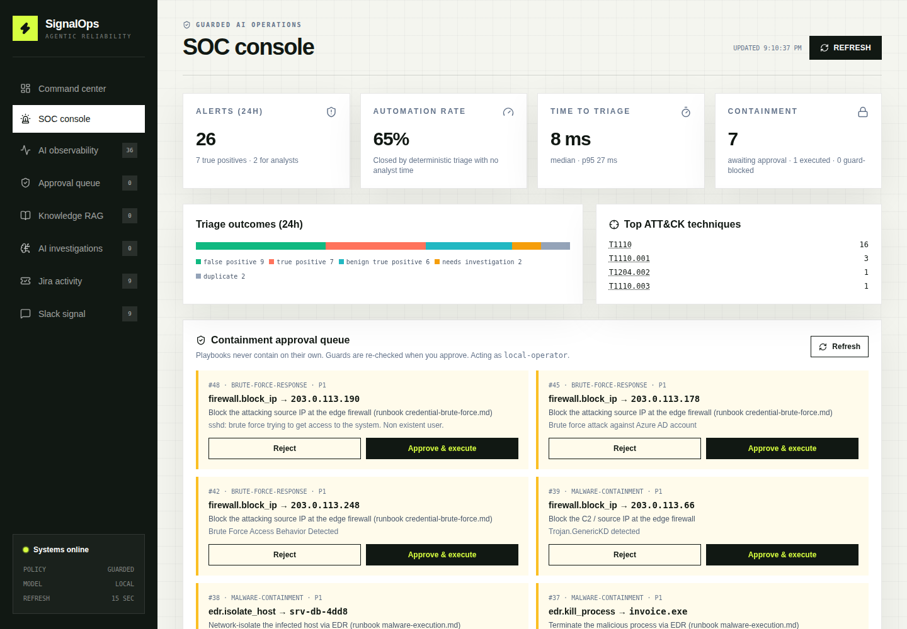
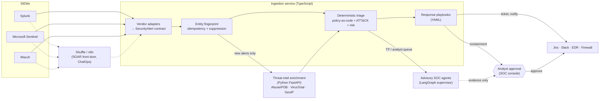
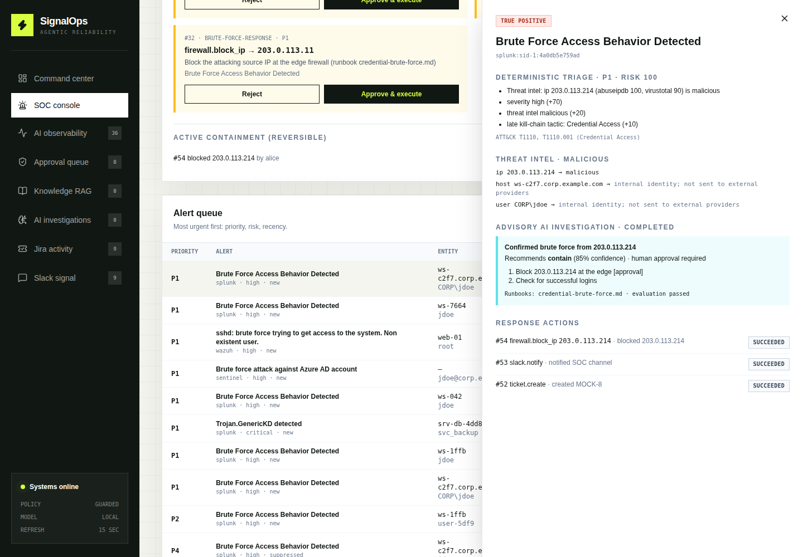

# Agentic SOC Automation Orchestrator

**SIEM alert in → deduplicated, enriched, triaged, investigated → human-approved response out.**
Deterministic code owns every decision and side effect; AI agents only advise.

[](https://github.com/rabinavidan/automation-failure-orchestrator/actions/workflows/ci.yml)
[](apps/enrichment-service)
[](apps/ingestion-service)
[](apps/ingestion-service/src/services/alert-normalizers)
[](docs/shuffle-soar-lab.md)
[](apps/ingestion-service/src/services/soc-investigation.ts)
[](infra/terraform/README.md)



---

## The 60-second pitch

|                       |                                                                                                                                                                                                                                                                                                                                                                        |
| --------------------- | ---------------------------------------------------------------------------------------------------------------------------------------------------------------------------------------------------------------------------------------------------------------------------------------------------------------------------------------------------------------------- |
| **Problem**           | SOC teams drown in duplicate, low-value alerts. Analysts spend their time re-checking the same IP and pasting context between tools. Handing that work to an LLM is risky, because a confident hallucination can block the wrong IP or isolate the wrong host.                                                                                                         |
| **What I built**      | An end-to-end SOC automation platform. It normalizes Splunk, Sentinel and Wazuh alerts onto one contract, collapses duplicates by entity fingerprint, enriches them with threat intel in Python, and triages them with policy-as-code mapped to MITRE ATT&CK. Advisory LangGraph agents investigate, and YAML playbooks respond. Containment always waits for a human. |
| **Why it's credible** | **320 automated tests** (275 TypeScript + 45 Python) and an agent-evaluation gate that fails on hallucinated IOCs. A real **Shuffle SOAR** playbook and a **zero-cost AWS SQS worker path** both run end-to-end in CI, and the Terraform is **Checkov-gated with 0 failed checks**. The key claims below each have a CI job behind them.                               |

## Proof, not claims: what CI runs on every push

| CI job                                               | What it proves                                                                                                                                     |
| ---------------------------------------------------- | -------------------------------------------------------------------------------------------------------------------------------------------------- |
| Quality and agent evaluations                        | Lint, format, typecheck, 275 unit/service tests, deterministic agent-evaluation suites (including the hallucinated-IOC gate)                       |
| Python enrichment service                            | `ruff` + `mypy --strict` + 45 `pytest` tests; a golden response contract is shared with the TypeScript consumer                                    |
| **Shuffle SOAR playbook (open source, self-hosted)** | Imports a playbook through Shuffle's REST API and runs it on real Shuffle. Asserts Splunk alert → orchestrator → `true_positive` → ChatOps message |
| **Zero-cost AWS demo (SQS worker on moto)**          | API → SQS → investigation worker → persisted result, with no AWS account and no cost                                                               |
| Terraform validate and IaC security scan             | `terraform validate` + Checkov: any unskipped finding fails the build (each skip is documented inline with a reason)                               |
| Docker build and smoke test                          | The full stack starts; API, proxy, action and idempotency smoke checks pass                                                                        |
| Runtime image security · dependency audit/review     | Trivy scans the ingestion, dashboard and enrichment images for critical CVEs; production dependency audit and review                               |

## Architecture



## Follow one alert through the system

A Splunk **"Brute Force Access Behavior Detected"** alert for source IP `203.0.113.50`:

1. **Ingest.** `POST /api/alerts/splunk` validates the native Splunk webhook and normalizes it onto the vendor-agnostic `SecurityAlert` contract. A malformed payload fails at the edge with a 400 or 422.
2. **Deduplicate.** An entity fingerprint (rule + host + user + IOCs, after identity normalization) recognizes the SIEM's webhook retry and suppresses the repeat. An analyst sees one alert, not five.
3. **Enrich.** The Python service queries threat-intel providers through a single-flight TTL cache. Private IPs and internal identities **never leave the network**. If enrichment fails, triage still runs (fail-open).
4. **Triage.** A priority-ordered rule chain (false positive → duplicate → true positive → known benign → needs investigation) returns **`true_positive`**, a risk score, P1–P4 and ATT&CK **T1110**, each with a recorded reason.
5. **Investigate (advisory).** A LangGraph supervisor and three specialists write a recommendation grounded in [`credential-brute-force.md`](docs/runbooks/credential-brute-force.md). An evaluator rejects any IOC that isn't present in the alert or its enrichment.
6. **Respond.** The [`brute-force-response`](config/playbooks/brute-force-response.yaml) playbook opens a ticket and pages Slack immediately. **`firewall.block_ip` waits for an analyst.** Blast-radius guards are re-checked at execution, the decision is exactly-once (a repeat returns 409), the action can be rolled back, and everything lands in an append-only audit log.



## Design decisions I can defend

| Decision                                                  | Why                                                                                                                                                                        | Trade-off I accepted                                                                           |
| --------------------------------------------------------- | -------------------------------------------------------------------------------------------------------------------------------------------------------------------------- | ---------------------------------------------------------------------------------------------- |
| **The LLM never takes an action**                         | Dispositions and side effects must be reproducible and testable. Agents add evidence; code sets `requiresHumanApproval`.                                                   | Less autonomy; the AI's value is measured as analyst time saved, not as actions taken.         |
| **Policy-as-code with expiring allowlists**               | Every auto-close has an owner and an expiry, so a stale suppression can't hide an attack. An invalid policy fails safe and closes nothing.                                 | Allowlists need periodic renewal (by design).                                                  |
| **Containment requires approval, enforced by the schema** | `PlaybookSchema` rejects any block/isolate/kill step without `approval: required`; guards run when the action is planned _and_ when it executes.                           | Mean time to contain includes a human; P1 auto-containment would be an explicit policy change. |
| **Exact fingerprints before embeddings**                  | Cheap, explainable and resistant to noise (UUIDs, timestamps, ports are stripped). Easy to defend in an incident review.                                                   | Near-duplicates need a future semantic layer.                                                  |
| **SOAR orchestrates; tested code decides**                | Shuffle/n8n own connectors, ChatOps and human workflow. Triage logic stays in versioned, unit-tested code. A test enforces that the n8n workflow contains no triage logic. | Two places to deploy; in exchange playbooks stay thin and portable across SOAR vendors.        |
| **Local models (Ollama), cloud-ready queue**              | Alert data stays on-premises; there is no per-token cost. `INVESTIGATION_QUEUE=sqs` moves agents to an SQS worker with a DLQ without changing code.                        | Local-model latency depends on hardware.                                                       |

## Run it in 5 minutes

```bash
cp .env.example .env && docker compose up --build -d
npm run demo:soc-triage        # five alerts, five dispositions (noise reduction)
npm run demo:soc-multi-siem    # Splunk, Sentinel and Wazuh → the same decision
npm run demo:soc-response      # playbook → approve firewall block → roll back, audited
open http://localhost:4173     # SOC console: KPIs, approval queue, evidence drawer
```

Optional, all zero cost:

```bash
# Real SOAR: self-hosted Shuffle running the SOC playbook (see the lab)
docker compose -f docker-compose.yml -f docker-compose.shuffle.yml up --build -d
npm run shuffle:setup && npm run shuffle:run

# AWS code path (SQS + worker) on moto, no AWS account
docker compose -f docker-compose.yml -f docker-compose.aws-local.yml up --build -d
npm run demo:aws-local
```

## Mapped to a Security Automation Engineer role

| Role requirement                        | Evidence in this repo                                                                                                                                                               |
| --------------------------------------- | ----------------------------------------------------------------------------------------------------------------------------------------------------------------------------------- |
| SOC automation, alert-fatigue reduction | Dedup + suppression, policy-as-code triage, automation-rate and time-to-triage KPIs ([`alert-processor.ts`](apps/ingestion-service/src/services/alert-processor.ts))                |
| SIEM integration                        | Splunk, Sentinel and Wazuh adapters onto one contract ([`alert-normalizers/`](apps/ingestion-service/src/services/alert-normalizers))                                               |
| SOAR playbooks                          | Shuffle playbook run in CI ([`shuffle/`](shuffle/soc-alert-playbook.json)), n8n SOC workflow, YAML response playbooks ([`config/playbooks/`](config/playbooks))                     |
| EDR / firewall response                 | Block IP, isolate host and kill process behind approval, guards and rollback ([`response-engine.ts`](apps/ingestion-service/src/services/response-engine.ts))                       |
| Python                                  | FastAPI enrichment service, async providers, `mypy --strict`, pytest + respx ([`apps/enrichment-service`](apps/enrichment-service))                                                 |
| Threat intel & MITRE ATT&CK             | AbuseIPDB / VirusTotal / GeoIP enrichment; technique mapping drives playbooks and runbook selection ([`docs/runbooks/`](docs/runbooks))                                             |
| AI agents with guardrails               | LangGraph supervisor, code-owned guardrails, hallucinated-IOC gate, prompt-injection hardening ([`soc-investigation.ts`](apps/ingestion-service/src/services/soc-investigation.ts)) |
| Cloud & IaC                             | Terraform for ECS Fargate, RDS, SQS + DLQ, WAF, KMS and GitHub OIDC; Checkov-gated ([`infra/terraform`](infra/terraform/README.md))                                                 |
| DevSecOps                               | CI quality gates, Trivy image scanning, dependency review, no long-lived cloud credentials (OIDC)                                                                                   |

## Honest scope

Interviewers respect a clear boundary, so here is what this project is and isn't:

- **Real:** the pipeline, triage engine, enrichment service, agents, evaluation gates, playbook engine, SOC console, and the Shuffle and AWS-on-moto runs in CI.
- **Simulated:** EDR, firewall, Jira and Slack are mock services ([`apps/mock-integrations`](apps/mock-integrations)). Threat intel runs in mock mode by default (`ENRICHMENT_MODE=live` plus API keys for real providers).
- **Not deployed:** the Terraform is validated and security-scanned but has never been applied (the demo is deliberately zero cost).
- **SOAR experience:** this is hands-on Shuffle work plus SOAR-style engineering, not production experience on Torq, XSOAR or Splunk SOAR. The [Shuffle lab](docs/shuffle-soar-lab.md) is the hands-on part.
- **Next steps I'd take:** SSO-backed reviewer identity and two-person approval for P1 isolation, SIEM write-back (closing incidents in Sentinel), OpenTelemetry trace export, and a semantic near-duplicate layer.

## Also inside: the same engine for CI failures

The project started as a **CI-failure orchestrator**: Playwright results → fingerprint → classify (known bug, infrastructure, automation, flaky, new regression) → multi-agent investigation → Jira/Slack, with LangGraph human-in-the-loop interrupts and LLM-as-judge evaluation. The SOC track reuses its contracts, fingerprinting, deterministic decision chain, agents, approvals and observability. Details are in the [platform reference](docs/platform-reference.md).

## Go deeper

| Document                                                                      | For                                                                             |
| ----------------------------------------------------------------------------- | ------------------------------------------------------------------------------- |
| [`docs/soc-interview-guide.md`](docs/soc-interview-guide.md)                  | 10-minute demo script, design questions with answers, where to look in the code |
| [`docs/platform-reference.md`](docs/platform-reference.md)                    | Full architecture, agent design, API surface, data model, configuration         |
| [`docs/soc-automation-roadmap.md`](docs/soc-automation-roadmap.md)            | SOC milestones M1–M8 and safety properties                                      |
| [`docs/shuffle-soar-lab.md`](docs/shuffle-soar-lab.md)                        | Hands-on Shuffle SOAR exercises                                                 |
| [`infra/terraform/README.md`](infra/terraform/README.md)                      | AWS architecture, security controls, the zero-cost demo                         |
| [`docs/api.md`](docs/api.md) · [`docs/architecture.md`](docs/architecture.md) | API contracts · component details                                               |

```text
apps/ingestion-service    TypeScript API: alert pipeline, triage, agents, playbooks
apps/enrichment-service   Python FastAPI threat-intel enrichment
apps/dashboard            React SOC console + CI ops console
apps/mock-integrations    Jira, Slack, EDR, firewall mocks
packages/*                Shared Zod contracts, fingerprint engine, triage/classification rules
config/                   Triage policy-as-code, response playbooks
shuffle/ · n8n/           SOAR playbooks
infra/terraform           AWS (Checkov-gated, never applied)
```

---

This repository is an engineering portfolio and reference implementation. Review the security, authentication and operational requirements before adapting it for production.
